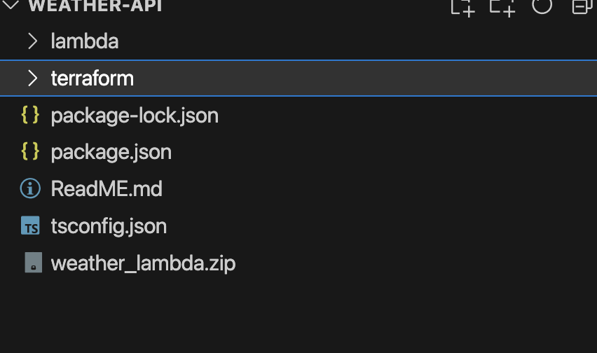

# Project Name

## Overview

This project consists of an AWS Lambda function implemented in TypeScript and managed using Terraform. The Lambda function handles specific tasks, and the Terraform configuration provisions the necessary infrastructure.

## Project Structure





## Prerequisites

- [Node.js](https://nodejs.org/) (version 18.x or later)
- [AWS CLI](https://aws.amazon.com/cli/)
- [Terraform](https://www.terraform.io/downloads.html)

## Getting Started

### 1. Setting Up the Lambda Function

1. Navigate to the `lambda` directory:
   ```bash
   cd lambda

2. Install dependencies:
  ```bash
   npm install

  ```

3. Compile TypeScript to JavaScrip
 ```bash
  npm run build

  ```
4. Create the ZIP file containing the Lambda function:
 ```bash
  zip -r wether_lambda.zip dist/*

  ```
1. Navigate to the `lambda` directory:

### 1. Setting Up the Terraform Infra

1. Navigate to the terraform directory:
 ```bash
  cd ../terraform

  ```
cd ../terraform


2. Initialize Terraform:
 ```bash
  terraform init

  ```
3. Review the planned changes:
 ```bash
terraform plan

  ```
4. Apply the configuration to provision the infrastructure:
 ```bash
  terraform apply

  ```


Deploying Changes
After making changes to the Lambda function, repeat the steps in the Getting Started section to recompile the code and update the lambda.zip file.
Run terraform apply again if there are infrastructure changes.


Sample is putup here Input Output for 3rd party api Navigations
https://medium.com/@vikas.comau/sample-application-aws-lambda-api-gateway-and-aws-s3-f14b2498152f

We can simply hit the url for deployed lambda with api gateway in browser for response for example city london

https://khkrzcu935.execute-api.ap-southeast-2.amazonaws.com/dev/weather/london

# Consideration
It can be improved from security persective and test can be added and bit of refactoing and DNS configuration 
